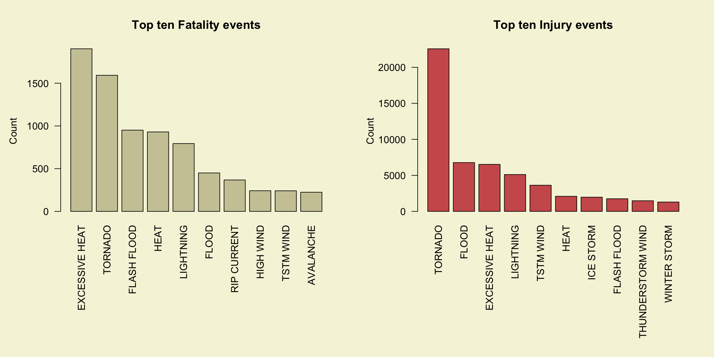
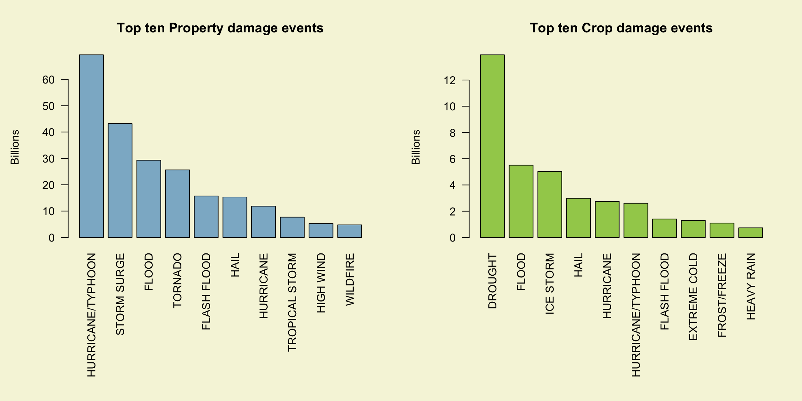
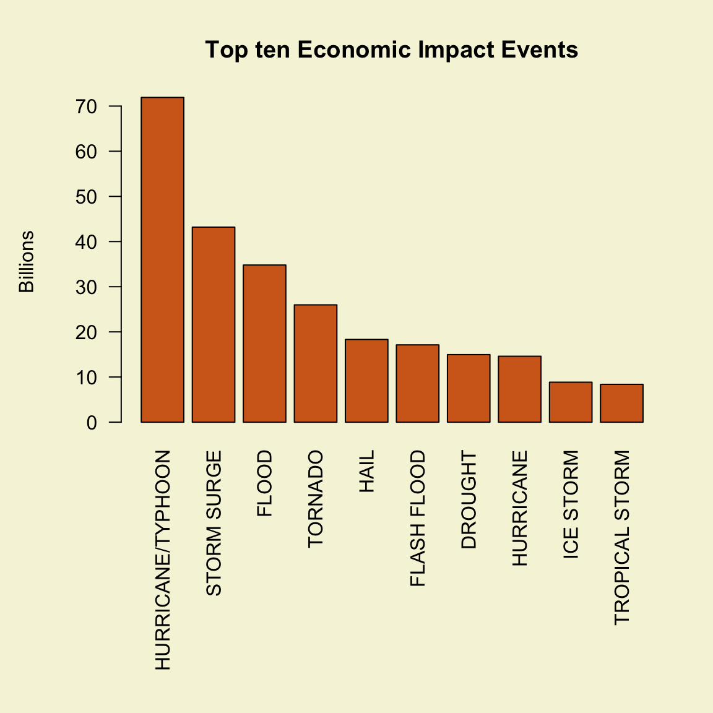

# Peer Assessment 2 - Reproducible research
agcode  
18 November 2015  


# The Impact of Severe Weather Events on Public Health and Economy in the United States


### I. Synopsys

In this study we explore the U.S. National Oceanic and Atmospheric Administration's (NOAA) Storm database with a goal of addressing the following two questions: 

* Across the United States, which types of events are most harmful with respect to population health?  
* Across the United States, which types of events have the greatest economic consequences?  

The questions are answered with the help of three figures in the "Results" section of this report. The first two figures are panel plots and the third is an independent plot. In effect, just Figure 1 and Figure 3 are necessary to answer the questions posed.

The analysis mandates no more than three figures, though figures may have multiple plots in them (i.e. panel plots). This assignment has 3 figures in the results section. 

The data is available from the year 1950 to November 2011. Since fewer events were recorded in the earlier years (inspecting the histogram), only data from the year 1994 is considered in this analysis.

The data-processing stage has been divided into four steps, with the last two focussing on the processing required to explore answers to the two questions.

### II. Data Processing

Loading and Pre-Processing the data

**Step 1 : Read the data into R**

[ Data source : https://d396qusza40orc.cloudfront.net/repdata%2Fdata%2FStormData.csv.bz2 ]

[ Storm Data Documentation : https://d396qusza40orc.cloudfront.net/repdata%2Fpeer2_doc%2Fpd01016005curr.pdf ]


```r
data <- read.csv("repdata-data-StormData.csv.bz2", header= T, stringsAsFactors = FALSE)
str(data)
```

```
## 'data.frame':	902297 obs. of  37 variables:
##  $ STATE__   : num  1 1 1 1 1 1 1 1 1 1 ...
##  $ BGN_DATE  : chr  "4/18/1950 0:00:00" "4/18/1950 0:00:00" "2/20/1951 0:00:00" "6/8/1951 0:00:00" ...
##  $ BGN_TIME  : chr  "0130" "0145" "1600" "0900" ...
##  $ TIME_ZONE : chr  "CST" "CST" "CST" "CST" ...
##  $ COUNTY    : num  97 3 57 89 43 77 9 123 125 57 ...
##  $ COUNTYNAME: chr  "MOBILE" "BALDWIN" "FAYETTE" "MADISON" ...
##  $ STATE     : chr  "AL" "AL" "AL" "AL" ...
##  $ EVTYPE    : chr  "TORNADO" "TORNADO" "TORNADO" "TORNADO" ...
##  $ BGN_RANGE : num  0 0 0 0 0 0 0 0 0 0 ...
##  $ BGN_AZI   : chr  "" "" "" "" ...
##  $ BGN_LOCATI: chr  "" "" "" "" ...
##  $ END_DATE  : chr  "" "" "" "" ...
##  $ END_TIME  : chr  "" "" "" "" ...
##  $ COUNTY_END: num  0 0 0 0 0 0 0 0 0 0 ...
##  $ COUNTYENDN: logi  NA NA NA NA NA NA ...
##  $ END_RANGE : num  0 0 0 0 0 0 0 0 0 0 ...
##  $ END_AZI   : chr  "" "" "" "" ...
##  $ END_LOCATI: chr  "" "" "" "" ...
##  $ LENGTH    : num  14 2 0.1 0 0 1.5 1.5 0 3.3 2.3 ...
##  $ WIDTH     : num  100 150 123 100 150 177 33 33 100 100 ...
##  $ F         : int  3 2 2 2 2 2 2 1 3 3 ...
##  $ MAG       : num  0 0 0 0 0 0 0 0 0 0 ...
##  $ FATALITIES: num  0 0 0 0 0 0 0 0 1 0 ...
##  $ INJURIES  : num  15 0 2 2 2 6 1 0 14 0 ...
##  $ PROPDMG   : num  25 2.5 25 2.5 2.5 2.5 2.5 2.5 25 25 ...
##  $ PROPDMGEXP: chr  "K" "K" "K" "K" ...
##  $ CROPDMG   : num  0 0 0 0 0 0 0 0 0 0 ...
##  $ CROPDMGEXP: chr  "" "" "" "" ...
##  $ WFO       : chr  "" "" "" "" ...
##  $ STATEOFFIC: chr  "" "" "" "" ...
##  $ ZONENAMES : chr  "" "" "" "" ...
##  $ LATITUDE  : num  3040 3042 3340 3458 3412 ...
##  $ LONGITUDE : num  8812 8755 8742 8626 8642 ...
##  $ LATITUDE_E: num  3051 0 0 0 0 ...
##  $ LONGITUDE_: num  8806 0 0 0 0 ...
##  $ REMARKS   : chr  "" "" "" "" ...
##  $ REFNUM    : num  1 2 3 4 5 6 7 8 9 10 ...
```
**Step 2 : Sanitize the data**

This includes a specific data fix and a a filtering of more recent years to be considered for the case. 

```r
# Specific Data Fix :  A single event in the data set has a damage multiplier of 1000 times greater than the actual damages; the remarks field/column in the data set for this event should be read; the REFNUM is 605943. This is a flood record with an exponent of B (billion) which should be M (million). Failing to make this fix has a tremendous impact on the property/crop damage results. Specifically, it overstates the value for FLOOD by some $115B. [From the discussion forums]

data[605953,26] <- "M"

# More recent years are considered complete : The events in the database start in the year 1950 and end in November 2011. In the earlier years of the database there are generally fewer events recorded, most likely due to a lack of good records. More recent years should be considered more complete.

data$year <- as.numeric(format(as.Date(data$BGN_DATE, format = "%m/%d/%Y %H:%M:%S"), "%Y"))
table(data$year)
```

```
## 
##  1950  1951  1952  1953  1954  1955  1956  1957  1958  1959  1960  1961 
##   223   269   272   492   609  1413  1703  2184  2213  1813  1945  2246 
##  1962  1963  1964  1965  1966  1967  1968  1969  1970  1971  1972  1973 
##  2389  1968  2348  2855  2388  2688  3312  2926  3215  3471  2168  4463 
##  1974  1975  1976  1977  1978  1979  1980  1981  1982  1983  1984  1985 
##  5386  4975  3768  3728  3657  4279  6146  4517  7132  8322  7335  7979 
##  1986  1987  1988  1989  1990  1991  1992  1993  1994  1995  1996  1997 
##  8726  7367  7257 10410 10946 12522 13534 12607 20631 27970 32270 28680 
##  1998  1999  2000  2001  2002  2003  2004  2005  2006  2007  2008  2009 
## 38128 31289 34471 34962 36293 39752 39363 39184 44034 43289 55663 45817 
##  2010  2011 
## 48161 62174
```

```r
# This indicates that 1989 onwards the number of observations are above 10,000 and 1994 onwards the number of observations are above 20,000. 
data <- data[data$year >= 1994, ]
dim(data)
```

```
## [1] 702131     38
```
By ignoring all years before 1994 the number of observations has reduced from 902297 to 702131.

**Step 3 : Processing for Question 1** 

To answer the question : which types of events (as indicated in the EVTYPE variable) are most harmful with respect to population health across the United States, I extract 3 columns: event type, fatalities and injuries. The sum of fatalitites and injuries is calculated for each event.


```r
## Subsetting
events <- data.frame(eventtype=data$EVTYPE,fatalities=data$FATALITIES, injuries=data$INJURIES)

## Calculate aggregates of fatalities and injuries for each event
listfatal <- aggregate(events$fatalities,by=list(events$eventtype), FUN=sum)
names(listfatal) <- c("event","total.fatalities")
listinjuries <- aggregate(events$injuries, by= list(events$eventtype), FUN=sum)
names(listinjuries) <- c("event","total.injuries")

## Sort sum.fatal and sum.injuries in decreasing order
listfatal <- listfatal[order(listfatal$total.fatalities,decreasing=TRUE),]
listinjuries <- listinjuries[order(listinjuries$total.injuries,decreasing=TRUE),]

# List the sorted vectors
head(listfatal)
```

```
##              event total.fatalities
## 116 EXCESSIVE HEAT             1903
## 777        TORNADO             1593
## 143    FLASH FLOOD              951
## 256           HEAT              930
## 426      LIGHTNING              794
## 157          FLOOD              450
```

```r
head(listinjuries)
```

```
##              event total.injuries
## 777        TORNADO          22571
## 157          FLOOD           6778
## 116 EXCESSIVE HEAT           6525
## 426      LIGHTNING           5116
## 796      TSTM WIND           3631
## 256           HEAT           2095
```

```r
# Create vectors of the top 10 fatal and injury events
fatal10 <- listfatal[1:10,]
fatal10 <- fatal10[order(fatal10$total.fatalities,decreasing=TRUE),]
injuries10 <- listinjuries[1:10,]
injuries10 <- injuries10[order(injuries10$total.injuries,decreasing=TRUE),]
```

From this list, it is observed that the highest number of fatalities and injuries are produced by tornados.

**Step 4 : Processing for Question 2**

To answer the question : which types of events have the greatest economic consequences across the United States, I extract 5 columns: event type, crop damage and its exponent and property damage and its exponent. Actual crop damage value is calculated by multiplying it with the exponents as per the following list.

These are possible values of CROPDMGEXP and PROPDMGEXP being used for further processing:

*H,h,K,k,M,m,B,b,+,-,?,0,1,2,3,4,5,6,7,8, and blank-character*

* H,h = hundreds = 100
* K,k = kilos = thousands = 1,000
* M,m = millions = 1,000,000
* B,b = billions = 1,000,000,000
* (+) = 1
* (-) = 0
* (?) = 0
* black/empty character = 0
* numeric 0..8 = 10

*Source : [flyingdisk on github](https://github.com/flyingdisc/RepData_PeerAssessment2/blob/master/how-to-handle-PROPDMGEXP.md) *

Aggregates of crop and property damage for each event are calculated.


```r
## Subsetting
devents <- data.frame(eventtype=data$EVTYPE,propdamage=data$PROPDMG,proplabel=tolower(data$PROPDMGEXP), cropdamage=data$CROPDMG, croplabel=tolower(data$CROPDMGEXP))
## Change the 2 labels columns from factors to characters
devents$proplabel <- as.character(devents$proplabel)
devents$croplabel <- as.character(devents$croplabel)
unique(devents$proplabel)
```

```
##  [1] ""  "b" "k" "m" "+" "0" "5" "6" "?" "4" "2" "3" "h" "7" "-" "1" "8"
```

```r
unique(devents$croplabel)
```

```
## [1] ""  "m" "k" "b" "?" "0" "2"
```

```r
## change all labels for properties damaged
devents$proplabel[devents$proplabel == "+"] <- 1
devents$proplabel[devents$proplabel %in% c("-","?","")] <- 0
devents$proplabel[devents$proplabel %in% c("0","1","2","3","4","5","6","7","8")] <- 10
devents$proplabel[devents$proplabel == "h"] <- 100
devents$proplabel[devents$proplabel == "k"] <- 1000
devents$proplabel[devents$proplabel == "m"] <- 1e+06
devents$proplabel[devents$proplabel == "b"] <- 1e+09

##change all lables for crop damaged
devents$croplabel[devents$croplabel %in% c("?","")] <- 0
devents$croplabel[devents$croplabel %in% c("0","2")] <- 10
devents$croplabel[devents$croplabel == "k"] <- 1000
devents$croplabel[devents$croplabel == "m"] <- 1e+06
devents$croplabel[devents$croplabel == "b"] <- 1e+09

## Inspect changes
unique(devents$proplabel)
```

```
## [1] "10"    "1e+09" "1000"  "1e+06" "100"
```

```r
unique(devents$croplabel)
```

```
## [1] "10"    "1e+06" "1000"  "1e+09"
```

```r
## Calculate by multiplying propdamage and its proplabel and cropdamage and its croplabel
devents$propdamage <- devents$propdamage*as.numeric(devents$proplabel)
devents$cropdamage <- devents$cropdamage*as.numeric(devents$croplabel)

## Take aggregates of properties and crop damage for each event
proplist <- aggregate(devents$propdamage,by=list(devents$eventtype), FUN=sum)
names(proplist) <- c("event","propdamage")
croplist <- aggregate(devents$cropdamage, by= list(devents$eventtype), FUN=sum)
names(croplist) <- c("event","cropdamage")

## Order events in decreasing order by damages
proplist <- proplist[order(proplist$propdamage,decreasing=TRUE),]
croplist <- croplist[order(croplist$cropdamage,decreasing=TRUE),]
head(proplist)
```

```
##                 event  propdamage
## 368 HURRICANE/TYPHOON 69305840000
## 610       STORM SURGE 43193536000
## 157             FLOOD 29294608870
## 777           TORNADO 25620371137
## 143       FLASH FLOOD 15716399031
## 227              HAIL 15335047377
```

```r
head(croplist)
```

```
##                 event  cropdamage
## 86            DROUGHT 13922066000
## 157             FLOOD  5506942450
## 396         ICE STORM  5022113500
## 227              HAIL  2982699330
## 361         HURRICANE  2741410000
## 368 HURRICANE/TYPHOON  2607872800
```

```r
# Create vectors of the top 10 property and crop events
prop10 <- proplist[1:10,]
prop10 <- prop10[order(prop10$propdamage,decreasing=TRUE),]
crop10 <- croplist[1:10,]
crop10 <- crop10[order(crop10$cropdamage,decreasing=TRUE),]

# Create vectors of the top 10 economic events
econlist <- aggregate(devents$propdamage+devents$cropdamage,by=list(devents$eventtype), FUN=sum)
names(econlist) <- c("event","damage")
econlist <- econlist[order(econlist$damage,decreasing=TRUE),]
econ10 <- econlist[1:10,]
```

### III. Results

**Most harmful events with respect to population health across the United States**

The highest number (5633) of fatalities and injuries are produced by tornados. The next highest (1903) contributor to fatality is excessive heat. 

The single greatest cause for injuries are tornado events, registering 91346 injuries. This is followed by TSTM wind, registering a significantly lower 6957 injuries. 

**Figure 1**

```r
# Plot the bar graphs
par(mfrow=c(1,2),mar = c(12,5,4,2) + 0.1 , mgp=c(3.5,1,0),bg="beige")
barplot(fatal10$total.fatalities,las= 2, names.arg = fatal10$event, col="lemonchiffon3",main="Top ten Fatality events", ylab="Count",xlab="", horiz=FALSE)
barplot(injuries10$total.injuries,las=2,names.arg=injuries10$event, col="indianred", main="Top ten Injury events", ylab="Count",xlab="", horiz=FALSE)
```

 

**Events that have the greatest economic consequences across the United States**

Hurricanes and typhoons cause the greatest property damage at $ 69 billion. This is followed by storm surge, flood and tornado that result in $ 43 billion, $ 29 billion and $ 25 billion in property damages respectively.

Note : Without the specific data fix that was executed in step 1, floods turn up as the most destructive event for properties. 

Droughts cause the most crop damage, at $ 13.9 billion. This is folowed by flood, ice-storm, hail and hurricane that cause damages amounting to $ 5.5 billion, $ 5 billion , $ 2.9 billion and $ 2.7 billion respectively.

*Since both crop damage and property damage are measured in terms of US$, it is also possible to combine the data to plot the events that cause the greatest economic consequences across the United States.* However, this is not possible in the case of injuries and fatalities, without weighing 1 fatality as 1 or 10 or .... injuries. 

**Figure 2**

```r
# Plot the bar graphs
par(mfrow=c(1,2),mar = c(12,5,4,2) + 0.1 , mgp=c(3.5,1,0),bg="beige")
barplot(prop10$propdamage/(10^9),las= 2, names.arg = prop10$event, col="lightskyblue3",main="Top ten Property damage events", ylab="Billions",xlab="", horiz=FALSE)
barplot(crop10$cropdamage/(10^9),las= 2, names.arg = crop10$event, col="darkolivegreen3", main="Top ten Crop damage events", ylab="Billions",xlab="", horiz=FALSE)
```

 
**Total Economic Consequences**

The plot below indicates that hurricanes and typhoons cause the most *economic* damage in the United States at $ 71.9 billion. This is followed by Storm surges, Floods, Tornados and Hail registering damages of $ 43 billion, $ 34.8 billion, $ 26 billion, $ 18.3 billion respectively.

**Figure 3**

```r
# Plot the bar graphs
par(mfrow=c(1,1),mar = c(12,5,4,2) + 0.1 , mgp=c(3.5,1,0),bg="beige")
barplot(econ10$damage/(10^9),las= 2, names.arg = econ10$event, col="chocolate",main="Top ten Economic Impact Events", ylab="Billions",xlab="", horiz=FALSE)
```

 
